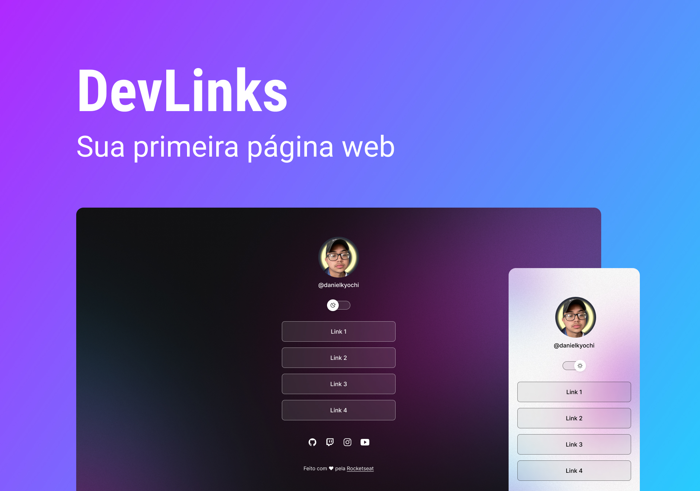

<h1 align="center"> DevLinks</h1>

Projeto criado no evento DevLinks promovido pela Rocketseat para ensino de tecnologias WEB.

  <a href="#-tecnologias">Tecnologias</a>&nbsp;&nbsp;&nbsp;|&nbsp;&nbsp;&nbsp;
  <a href="#-projeto">Projeto</a>&nbsp;&nbsp;

 

  

## 🚀 Tecnologias

Esse projeto foi desenvolvido com as seguintes tecnologias:

- HTML e CSS
- JavaScript
- Git e Github

 

## 💻 Projeto

O DevLinks é uma página programada para anexar os links que deseja compartilhar para o público.
[🔗 Clique aqui para acessar](https://dev-links-lovat.vercel.app/)

---

Feito com ♥ by Daniel Kyochi 🌍

